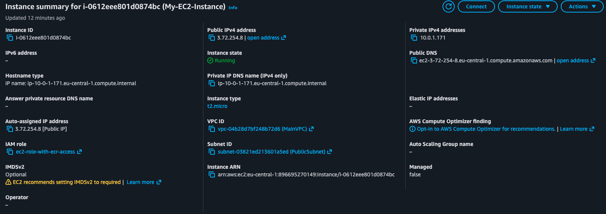
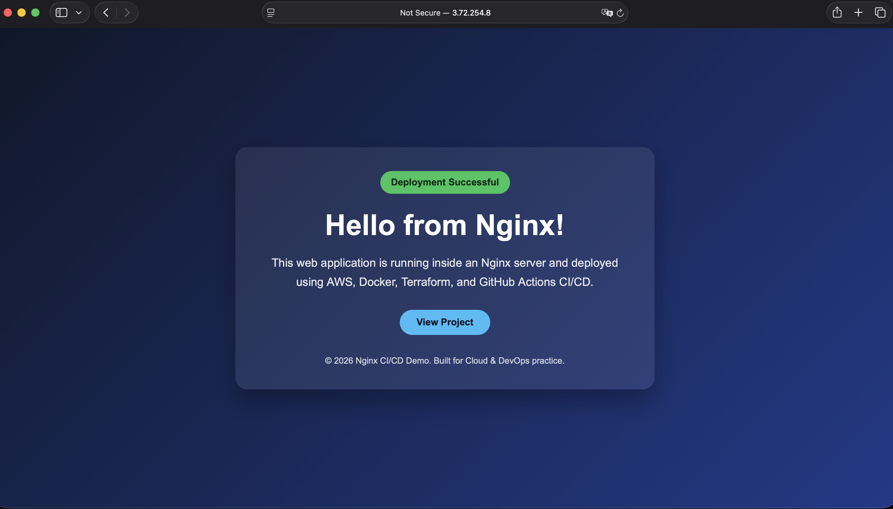

# Nginx CI/CD App on AWS

A complete end-to-end CI/CD project that provisions AWS infrastructure with Terraform, builds a Dockerized Nginx application, pushes the image to Amazon ECR, and deploys it to an EC2 instance using GitHub Actions.

## Project Overview

Whenever code is pushed to the `main` branch:

1. Terraform provisions or updates AWS infrastructure.
2. Docker builds a new Nginx image.
3. The image is pushed to Amazon ECR.
4. GitHub Actions connects to the EC2 instance via SSH.
5. EC2 pulls the new image from ECR.
6. The running container is replaced with the new version.

The workflow also supports manual destruction of all resources using `terraform destroy`.

## Architecture Overview

```text
Developer Pushes Code to GitHub
            |
            v
     GitHub Actions Workflow
            |
            v
      Terraform Apply
            |
            v
 AWS Infrastructure Created/Updated
 VPC + Subnet + Security Group + IAM + ECR + EC2
            |
            v
       Docker Build
            |
            v
      Push Image to ECR
            |
            v
        Deploy Job
            |
            v
        SSH to EC2
            |
            v
   Docker Pull from ECR
            |
            v
    Stop Old Container
            |
            v
    Run New Nginx Container
            |
            v
 Application Available on EC2 Public IP
```

## Technologies Used

- Terraform
- GitHub Actions
- Docker
- AWS EC2
- AWS ECR
- AWS IAM
- AWS VPC
- AWS S3 (Terraform Backend)
- Nginx

## GitHub Actions Workflow

The workflow contains four jobs:

### 1. Terraform Deployment

- Runs `terraform init`
- Runs `terraform apply`
- Captures Terraform outputs
- Uploads outputs as artifacts

### 2. Docker Build and Push

- Builds the Docker image
- Tags the image using `${{ github.sha }}`
- Pushes the image to Amazon ECR

### 3. Deploy to EC2

- Connects to EC2 via SSH
- Logs into Amazon ECR
- Pulls the new image
- Stops and removes the old container
- Starts a new container

### 4. Terraform Destroy

- Runs `terraform destroy -auto-approve`
- Triggered manually via `workflow_dispatch`

## Prerequisites

Before running this project, ensure you have:

1. An AWS account
2. An IAM user for GitHub Actions
3. An S3 bucket for Terraform backend
4. An EC2 Key Pair named `github-key`
5. A GitHub repository

## Terraform Backend Configuration

Terraform state is stored remotely in Amazon S3.

The S3 bucket must already exist before running:

```bash
terraform init
```

## Required GitHub Secrets

| Secret Name | Description |
|---|---|
| `AWS_ACCESS_KEY_ID` | AWS Access Key ID |
| `AWS_SECRET_ACCESS_KEY` | AWS Secret Access Key |
| `EC2_PRIVATE_KEY` | Private key content of `github-key.pem` |

## How to Run

### Automatic Deployment

Any push to the `main` branch automatically triggers:

- Terraform Apply
- Docker Build and Push
- Deployment to EC2

### Manual Apply

```text
GitHub → Actions → Run Workflow → apply
```

### Manual Destroy

```text
GitHub → Actions → Run Workflow → destroy
```

## Accessing the Application

After a successful deployment, GitHub Actions prints:

```text
App is now accessible at: http://<EC2_PUBLIC_IP>
```

Open the URL in your browser to view the application.


## Screenshots

### EC2 Instance Created by Terraform



### Nginx Application Running on EC2




## Security Notes

This project is intentionally simplified for learning purposes.

Current limitations:

- SSH `22` is open to `0.0.0.0/0`
- IAM policy uses `ecr:*`
- Deployment uses SSH instead of AWS Systems Manager

Recommended improvements:

- Restrict SSH access
- Replace `ecr:*` with least-privilege permissions
- Use AWS Systems Manager Session Manager
- Add HTTPS with AWS Certificate Manager

## Possible Enhancements

- Install Docker using EC2 `user_data`
- Add `terraform plan`
- Add automated tests
- Use Ansible for configuration management
- Deploy to Amazon ECS
- Add monitoring with CloudWatch

## License

This project is for educational and portfolio purposes.
